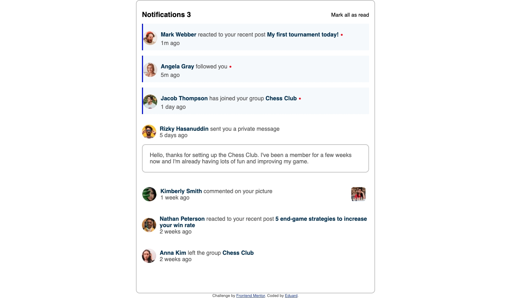
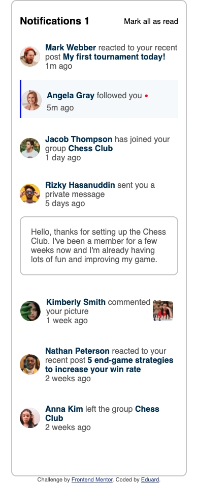

# 🛎️ Interactive Notifications page

Project link:

## Description

Interactive notification panel with notification counting and managment

## Features

1. 🔢 **Real-time** unread notification counter
2. 📍 **Visual highlighting** of unread messages
3. **Animations and interactivity** in interaction
4. 📱 **Adaptive interface**

## ⚙️ Installation and configuration

### Local load:

`git clone https://github.com/selikon13/notification-pager.git`

`cd notifications-page`

Open file index.html file in your browser or use Live Server in your code editor

### How to use

1. View the list of notifications
2. Tap on a notofocation to mark it as read
3. Use the "Mark all as read" button for mass reading
4. Watch the counter change in real time

## 📸 Screnshoots

### Desctop

### Mobile

## Technologies

- Structure: HTML
- Style: CSS3
- Logistics: Vanilla JavaScript
- Adaptive: Descktop-first + media queries

## Contacts

- Email: fnaffi095@gmail.com
- GitHub: selikon13 (https://github.com/selikon13)